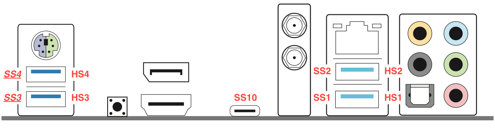

# Ryzen Mac Pro - OpenCore EFI for ASRock X570 ITX


This repository provides the basic EFI folder to run macOS Catalina on an ASRock Phantom Gaming ITX/TB3 motherboard. The default provided currently using a Ryzen 9 3900X 12 Core CPU and a Radeon RX 5500 XT. For a short guide to using different CPUs and GPUs see below (all kexts specific to those are named explicitely).
This is intended as a reference and to share improvements for similar build, not as an out of the box EFI to download. It is highly recommended to start with a vanilla OpenCore and following OpenCore Vanilla Guide first.

## Ryzen Mac Pro build

**Prozessor:** AMD Ryzen 9 3900X  
**Cooler:** Corsair H80i v2 AIO  
**Motherboard:** AsRock X570 Phantom Gaming ITX/TB3 (BIOS 2.0)  
**Memory:** Corsair Vengeance RGB Pro (2x, 16GB) DDR4-3200  
**Storage:** Corsair MP600 (1000GB) M.2 NVMe PCIe 4.0  
**Video Card:** Sapphire Radeon RX 5500 XT Pulse 8G  
**Power Supply:** Corsair SF600 Platinum  
**Case:** Phanteks Enthoo Evolv Shift (Mini-ITX)  
**Case fans:** 2x Noctua NF-A14 PWM  
**AIO fans:** 2x Noctua NF-F12 PPC 2000 PWM  

### Notes
I've replaced the stock Corsai SP120 fans with Noctua's NF-F12 which are quite a bit cooler or quieter depending on how you set up your fan curves. 
Due to limited space it is not possible to connect the USB cable directly to the pump on this motherboard, instead I've ordered a flat Mini-USB head from [AliExpress](https://www.aliexpress.com/item/4000302723088.html?spm=a2g0s.9042311.0.0.6ef84c4doswqdH).
Liquidctl allows to controll the AIO under MacOS.

## Versions
**BIOS:** 2.0  
**OpenCore:** 0.5.8   
**macOS:** 10.15.5  

## Content

### ACPI

The following SSDT files are for setting up HPET and EC.

- SSDT-EC.aml
- SSDT-HPET.aml
- SSDT-PLUG.aml
- SSDT-SBRG.aml

The following SSDT files are for USB Power and properly name USB controllers and ports. Note: to fix sleep issues the internal HS10 port connected to bluetooth is **not** configured as internal. Currently also the internal USB 2 header is not mapped (the SSDT-XHC-full.aml contains all even unconnected ports to do a custom mapping).

- SSDT-USBX.aml
- SSDT-XHC.aml
- SSDT-XHC-XHC0.aml (either this or above - see section about sleep)

### Kexts

Besides the default kexts the following are noteworthy:

For enabling the integrated Intel Bluetooth

- IntelBluetoothFirmware.kext
- IntelBluetoothInjector.kext

The SMCAMDProcessor.kext is used to provide CPU temperature and frequency information, the AMD Power Gadget can be downloaded from https://github.com/trulyspinach/SMCAMDProcessor/releases. Other monitoring tools can also access and display this information.
AMDRyzenCPUPowerManagement-ES.kext is a custom compiled version with a few minor differences: Upon boot low power state (P2) is enabled and Core Performance Boost is desabled by default. Additionally the adjustment has been tuned down a little to not immediately go to the highest power state and go down again faster. This with the intent to not have the CPU going full power for just minor loads like opening an empty browser tab. Only use this kext if you know what you are doing as it requires P2 to work correctly on your CPU. 

The VoodooTSCSyncAMD kext is used to sync the cores and required the correct number of threads (cores * 2). Either update the Info.plist of the kext or create a new one with the VoodooTSCSync configurator.


The RadeonBoost kext is used to inject proper power management (AGPMInjector) and fixes some performance issues. It support SMBIOS iMacPro1,1/all MacPro and RX 480, 580, 590, 5500 (XT), 5600 (XT), 5700 (XT) and Radeon VII.
Note: As of 10.15.5 macOS is bugged and panics on boot when RadeonBoost is enabled for Navi cards.

The AMD-USB-Map kext is depending on the SMBIOS and can be created with the Hackintool.
See section about sleep for the other variant.


## Setup

### BIOS settings

Everything is tested with ASRocks latest BIOS v2.0:

- CSM: disabled
- Above 4G decoding: disabled (must be enabled for certain older graphics card)
- Thunderbolt: enabled
  - Security Level: No Security
- Fast boot: disabled

## USB port mapping

The front USB ports on the internal USB 3 header are SS5/HS5 and SS6/HS6.
The port of the internal USB header is mapped to HS9, the internal Bluetooth module to HS10.
In case the XHC0 controller is disabled, the ports 3/4 on the back I/O are USB 2 only.


| XHC0 -> XHCI | | |
| --- | --- | --- |
| PRT1 | HS4 | USB 2 |
| PRT4 | HS9 | internal USB 2 |
| PRT5 | HS2 | USB 2 |
| PRT6 | HS1 | USB 2 |
| PRT9 | SS1 | USB 2 |
| PRT10 | SS2 | USB 2 |

| XHC1 -> XHC | | |
| --- | --- | --- |
| PRT1 | HS6 | USB 2 |
| PRT2 | HS10 | Bluetooth |
| PRT3 | HS5 | USB 2 |
| PRT4 | SS10 | USB Type C |
| PRT7 | SS6 | USB 3 |
| PRT8 | SS5 | USB 3 |

| XHC0 -> XHC2 | | |
| --- | --- | --- |
| PRT7 | SS3 | USB 3 |
| PRT8 | SS4 | USB 3 |

_(The last is the problematic controller causing wake up issues)_

Best way is to disable that controller in BIOS: AMD PBS -> FCH Common Options -> XCHI Controller 0 to disabled


## Known issues

Thunderbolt controller is not detected by MacOS unless device is already connected during boot. Hot plug is now supported with SSDT-TB3.aml file. (Thanks to [XinJiangCN](https://github.com/XinJiangCN) for that)

The integrated Intel Wifi is not yet supported.

Microphone is not yet working through integrated audio codec.

### Sleep

Sleep can be a difficult topic with little things breaking either entering or leaving sleep. A major source issues for waking up (causing a reboot) is the XHC0 USB Controller, with it disabled and the hibernate fixup kext waking up from sleep seems to work so far.

Lucky us only two USB 3 ports are connected to this controller (the outer ones on the I/O plane) and will be reduced to USB 2 speed. 
To do this replace

- SSDT-XHC.aml -> SSDT-XHC-XHC0.aml
- AMD-USB-Map-MacPro7,1.kext -> AMD-USB-Map-XHC0-MacPro7,1.kext

And make sure boot flag -hbfx-disable-patch-pci is set.

If it does not entering sleep properly there are some things to be tried:

- Disable "Allow Bluetooth devices to wake this computer" in Advanced Bluetooth settings (may require the use of the power button if keyboard and mouse are connected through standard bluetooth)
- Disconnect specific bluetooth devices (like monitor speakers and the like)
- Turn off monitor before entering sleep

Note that the AIO prevents sleep from working if the pump is connected by USB, even if the port is not configured. I'm currently working around this by connecting the pump one of the external USB ports to manually disconnect it before going to sleep until I can find an internal USB hub which supports PPPS (per port power switch) to disable the connection through software.


### Bluetooth

The bluetooth firmware may fail to load and disable Bluetooth completely. This case can usually be fixed with a reboot.
With deep sleep in S5 enabled in the BIOS this seems to happen regurarely, disabling may help reducing this issue. Reseting the NVRAM also leads to this issue but manually setting the the value in the NVRAM section of the `config.plist` will solve this:

```
<key>bluetoothActiveControllerInfo</key>
<data></data>
```
You can extract the proper data value with the Hackintool.

## Notes

Use at your own risk.

Discussions:
* [AMD OS X](https://forum.amd-osx.com/index.php?threads/ryzen-9-3900x-asrock-x570-itx-tb3-sapphire-rx-5500-pulse-catalina.19/)
* [Hackintosh Forum](https://www.hackintosh-forum.de/forum/thread/46160-ryzen-9-3900x-asrock-x570-itx-radeon-rx-5500-xt/)

Cedits and links:
* [OpenCore Desktop Guide](https://github.com/dortania/OpenCore-Desktop-Guide)
* [AMD OC Ryzen](https://github.com/iGPU/AMD_OC_Ryzen)
* [CMMChris' RadeonBoost](https://www.hackintosh-forum.de/forum/thread/47791-radeonboost-kext-benchmark-scores-wie-am-echten-mac-unter-windows/?pageNo=1)
* [trulyspinach's SMCAMDProcessor](https://github.com/trulyspinach/SMCAMDProcessor)
* [khronokernel's SmallTree](https://github.com/khronokernel/SmallTree-I211-AT-patch)
* [Hackintool](https://www.hackintosh-forum.de/forum/thread/38316-hackintool-ehemals-intel-fb-patcher/)
* [VoodooTSCSync Configurator](https://www.insanelymac.com/forum/files/file/744-voodootscsync-configurator/)
* [Liquidctl](https://github.com/jonasmalacofilho/liquidctl)
